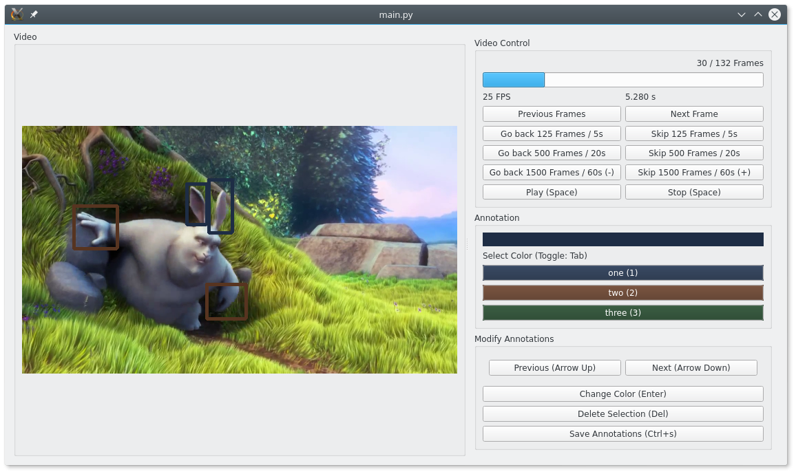

# Video Annotator

This program annotates video files for object detection.

## Example



This image shows a part of the video
[Big Buck Bunny](http://bbb3d.renderfarming.net/)
(released under [CC-BY 3.0](https://creativecommons.org/licenses/by/3.0/))
in the video annotator. Ears and hands of the rabbit are annotated
with bounding boxes.

## Install

The recommended way to install the dependencies of this tool is conda.
We provide a conda environment.yml. After cloning this repository
you can run

    conda env create -f environment.yml

to create a conda environment with all dependencies.
If you do not want to use conda you can take a look at the file to find
out which dependencies we need. Note that some libraries (OpenCV, PyQt)
cannot be installed only with pip.

## Quick Start

We have to know which classes you want to label. This information is
provided by a configuration file in yaml format:

```yaml
classes:
- name of class 1
- name of class 2
- name of class 3
# optional: resolution of extracted images
resolution:
- 1280
- 720
```

Then run the program with

    python main.py [video file] [output directory] --config [configuration file]

## Output

We will extract images and bounding boxes. Bounding boxes are given in
a csv file. The format looks similar to this:

```
out/annotated_68312937d288981ae8b4b1bbc5d7d2ec_00000000.jpg,0,297,255,358,356,0
out/annotated_68312937d288981ae8b4b1bbc5d7d2ec_00000000.jpg,0,369,264,436,359,0
out/annotated_68312937d288981ae8b4b1bbc5d7d2ec_00000000.jpg,0,252,326,314,418,1
```

The first column contains the name of the corresponding image. The hash
that is contained in the file name is unique per video file. The second
column contains the frame index in the video file. The bounding box is
given in the next four columns by upper left x and y coordinates and
lower right x and y coordinates. The last line contains the index of the
assigned class.