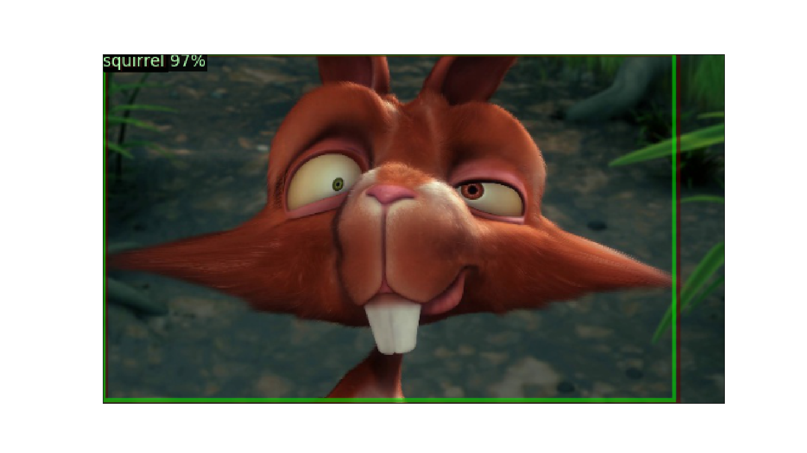
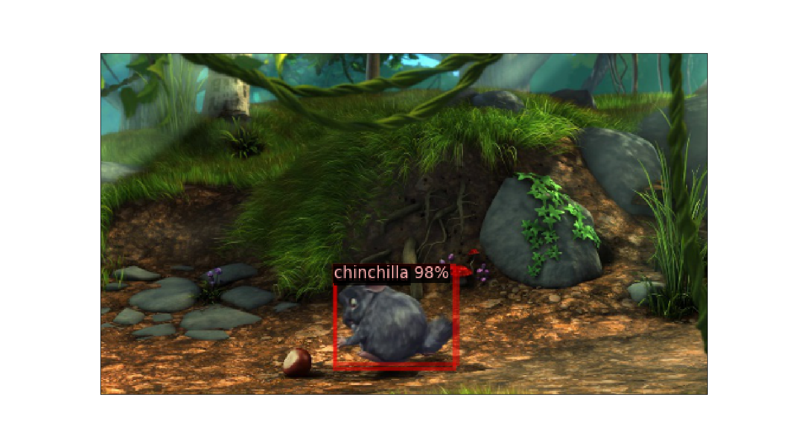
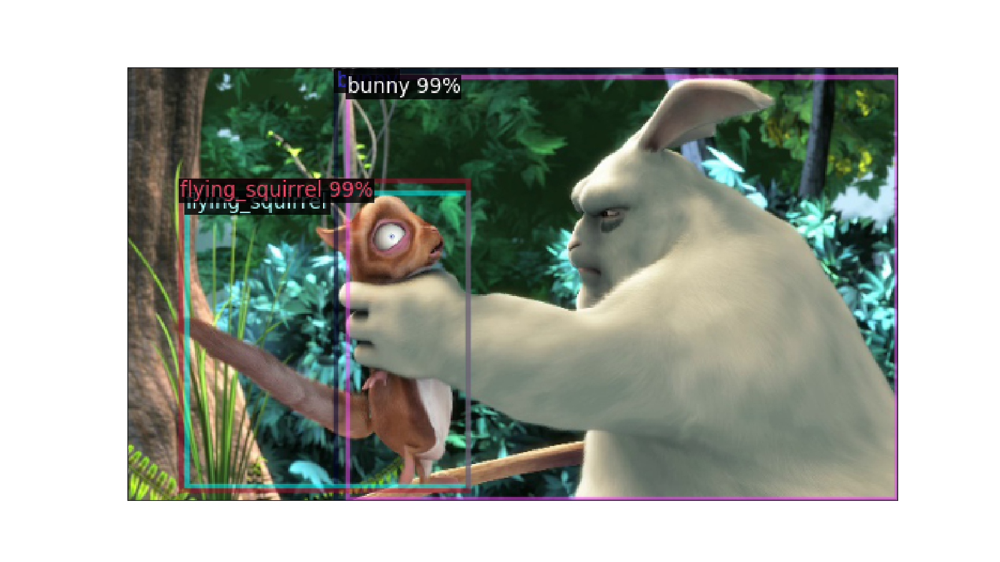
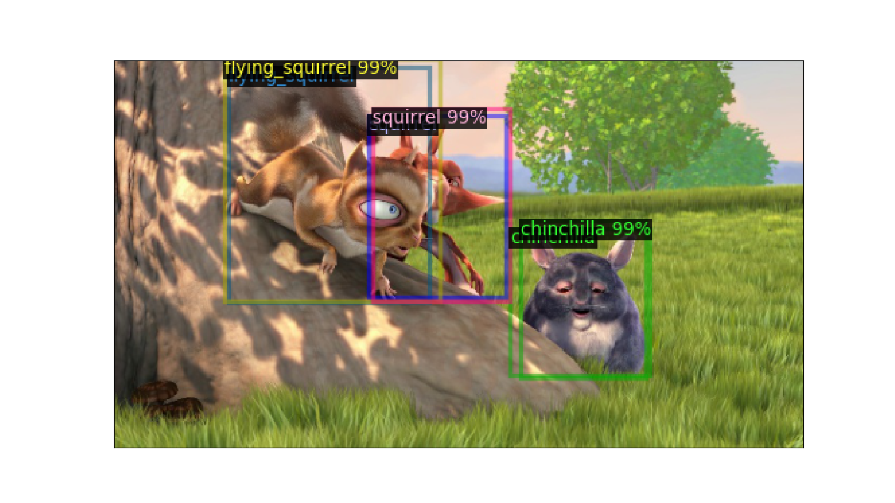
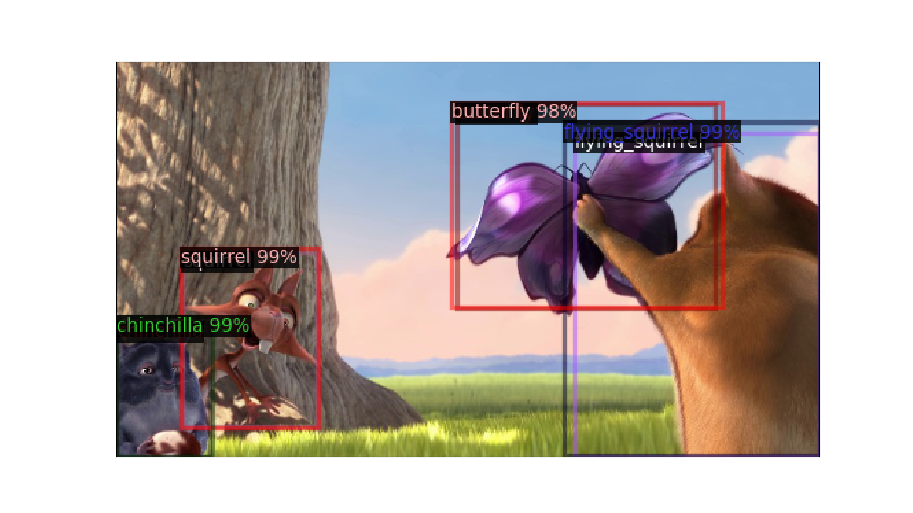
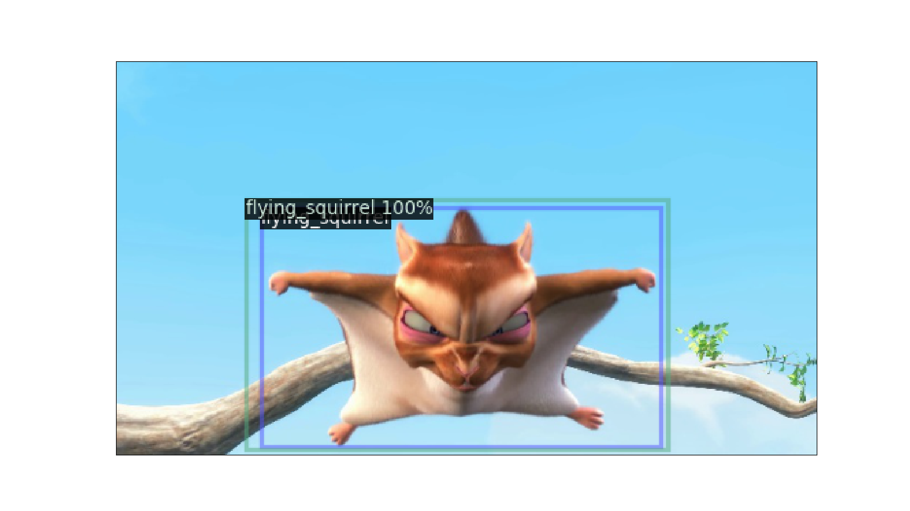
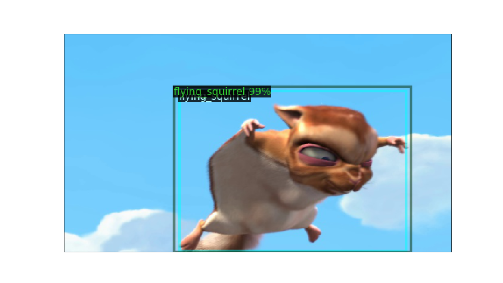
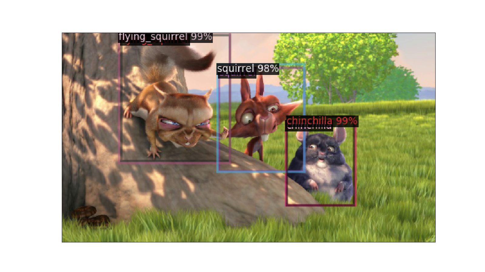
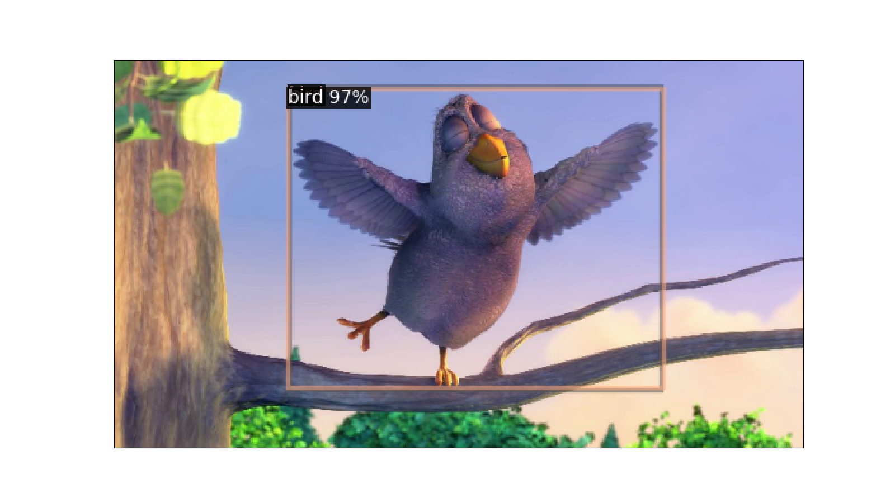
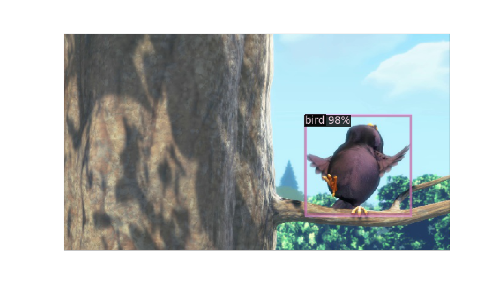

## Example

This is an example of how the annotated data can be used to train a neural
network for object detection. We will use
[Detectron 2](https://github.com/facebookresearch/detectron2) from Facebook
AI research. It is quite easy to use. The most difficult hurdle to run this
example on your own computer is probably the installation of all the
dependencies. Note that we don't provide any support for that.

In this example we will use the video
[Big Buck Bunny](http://bbb3d.renderfarming.net/).
I downloaded the version with 2D, Full HD, 30 fps.
We will try to detect the animals that appear in this video. There are
six different types of animals: bunny, flying squirrel, squirrel,
chinchilla, butterfly and bird. This is the annotator configuration
that I use:

```yaml
classes:
- bunny
- flying_squirrel
- squirrel
- chinchilla
- butterfly
- bird
resolution:
- 640
- 360
```

Now you can start the annotator with the given configuration:

    python main.py bbb_sunflower_1080p_30fps_normal.mp4 bbb_dataset --config bbb_config.yml

I labeled 72 images with 117 bounding boxes.

    $ ls bbb_dataset/*.jpg | wc -l
    72
    $ cat bbb_dataset/annotations.csv | wc -l
    117

Now we can start training. I will assume that the Detectron 2 repository is in the
current working directory which should be the main folder of the annotator. We will
take a pretrained object detection model. You have to download the initial weights
from the [model zoo](https://github.com/facebookresearch/detectron2/blob/master/MODEL_ZOO.md#coco-object-detection-baselines).
I will train a Faster R-CNN based on ResNet-50 (R50-FPN in the model zoo).
Which kind of architecture you can train depends on your GPU. I have a GPU with only
6 GB of memory. You can change the architecture by changing the model configuration
parameter. Make sure to download the corresponding initial weights from the model zoo.

    export PYTHONPATH=.:$PYTHONPATH  # sometimes required
    python examples/train_detectron2.py detectron2/model_final_280758.pkl . bbb_dataset/ --config bbb_config.yml --model_config detectron2/configs/COCO-Detection/faster_rcnn_R_50_FPN_1x.yaml --max_iter 2000

Detectron 2 will store the final weights in the folder `output/model_final.pth`.

Now that we refined the model for a couple of iteration we can check if it fits the
training data good enough:

    python examples/test_detectron2.py --n_samples 10 --model_weights output/model_final.pth --config bbb_config.yml . bbb_dataset/

In my case the output looks like this:

<table>
<tr>
<td></td>
<td></td>
</tr>
<tr>
<td></td>
<td></td>
</tr>
<tr>
<td></td>
<td></td>
</tr>
<tr>
<td></td>
<td></td>
</tr>
<tr>
<td></td>
<td></td>
</tr>
</table>

We can also make predictions for the whole video and save them to files:

    python examples/test_detectron2_video.py --skip_frames 1 --model_weights output/model_final.pth --config bbb_config.yml bbb_sunflower_1080p_30fps_normal.mp4 bbb_video/

You can create a video from the files, for example, with mencoder under linux:

    mencoder "mf://bbb_video/prediction*.jpg" -o movie.avi -ovc lavc -lavcopts vcodec=mjpeg

Note that the predictions will probably still contain a lot of false positives
since we only trained for 2000 iterations and with a very small dataset.
